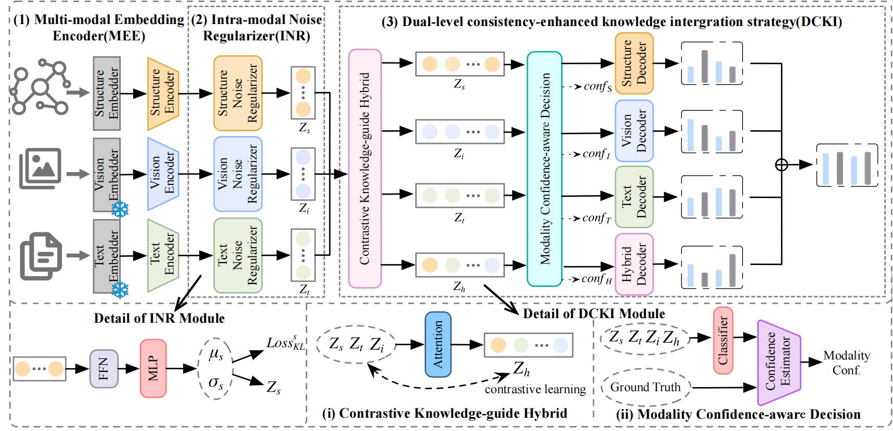

# ROAD: Robust and Adaptive Denoising representation learning Framework for Multi-Modal Knowledge Graph Completion
## overview

## Code Structure
├── checkpoint
│   ├── DB15K
│   ├── MKG-W
│   └── MKG-Y
├── datasets
│   ├── DB15K
│   ├── MKG-W
│   └── MKG-Y
├── layers
│   ├── __init__.py
│   ├── layer.py
├── models
│   ├── __init__.py
│   ├── model.py
│   ├── modules.py
│   ├── MoE.py
│   └── ROAD.py
├── ROAD.yml
├── run.sh
├── train.py
└── utils
    ├── data_loader.py
    ├── data_util.py
    ├── __init__.py
## Dependency
` conda env create -f ROAD.yml -n ROAD `
## Train 
  ` nohup bash run.sh > db15k.log 2>&1 &`
  `nohup bash run.sh > mkgw.log 2>&1 &`
  `nohup bash run.sh > mkgy.log 2>&1 &`

